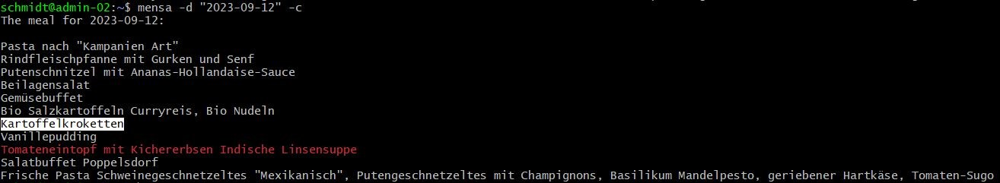

# Mensa Script

The Mensa script is a tool for fetching and filtering meal information from a website and printing it. It provides options to filter meals based on keywords and allows you to specify a custom date.


## Usage
```
schmidt@admin-02:~$ mensa --help
usage: mensa.py [-h] [-e] [-d D] [-c]

This script returns the meals of today in the Campo Mensa

optional arguments:
  -h, --help  show this help message and exit
  -e          Print only when keywords "suppe" or "eintopf" are found
  -d D        Specify a custom date in the format 'YYYY-MM-DD'
  -c          Color the meals according to -e (red) and Mayo-compatibility
```

Note that this scripts output goes directly to STDOUT, since it is intended to be used as a CLI tool only, not as a library. When importing the .py file, the code automatically gets executed. 

## Example



## Installation (Linux)

Clone the repository to your local machine, enter the folder and run `make`:

   ```bash
   git clone https://github.com/Jocho-Smith/campo-mensa-script.git
   cd campo-mensa-script
   make
   ```


## Acknowledgments
- Beautiful Soup - HTML parsing library used in this script.
- My good friend [civvi](https://github.com/civviGH) for the inspiration 
- [Felix R.](https://github.com/reeelix) for the insights of the web-page 
